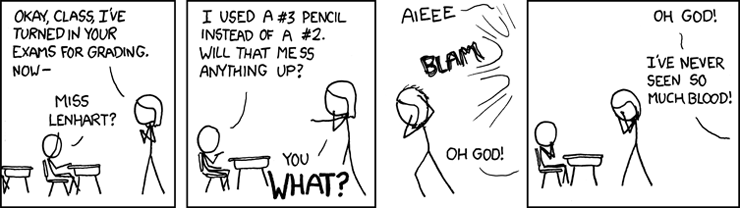
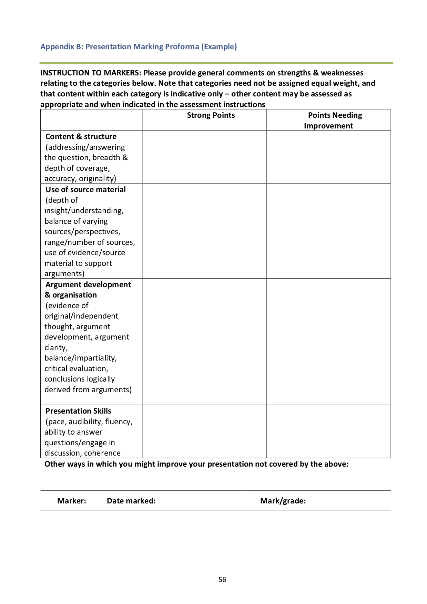

# Coursework and Assessment {#assessment}

\index{Asessment}

Assessment is an important component of the programme, and feedback is vital for
you to progress.

All assessment on the MSc and MPsych is based upon coursework, and we have no formal
examinations. Coursework is tailored to the needs of individual modules. Modules
may have several coursework components which make up the total assessment.



Assessment is a complex topic, but this section attempts to distill some of the
key information which students need to understand how their work is assessed on
the MSc and MPsych courses at Plymouth, including:

-   'Level descriptors': These are broad descriptions of what is expected from
    students on each type of course

-   Learning outcomes and assessment criteria

-   Marking schemes, grade boundaries

-   Marking and moderation processes

### Summary

All coursework in the school is marked on a categorical grade system, ranging
from A+ to F-, and all grades awarded to masters coursework are either
peer-moderated or second marked.

Each letter grade category is associated with a particular percentage mark which
is used to calculate the overall degree mark. The pass mark for postgraduate
courses is set at 50%.

Degree classifications are slightly different depending on whether you are and
MSc or MPsych student. See:

-   [MPsych classifications](#mpsych-classification)
-   [MSc classifications](#msc-classification)

_If you ever have a [question about a grade](#grade-queries) you have been
awarded_, in the first instance contact the module leader to discuss it, for
example during their [office hours](#office-hours).

## Submitting coursework

All work must be submitted via the DLE. No submissions can be accepted on paper,
or via email, unless this is required to meet specific accessibility
requirements.

### Pre-submission checklist

Before submitting work, you might like to use the following checklist.

::: {.checklist}

-   ☐ Reviewed previous feedback
-   ☐ Spell-checked manuscript
-   ☐ Proofread/grammar-check complete
-   ☐ [Cover sheet](#cover-sheet) attached
-   ☐ Converted to PDF

:::

### Coursework cover sheet {#cover-sheet}

> The MSc coursework cover sheet is available here:
> [masters_coursework_template.docx](static/templates/masters coursework template 2019-20.docx)

This coversheet includes a section in which you can write your reflections on
your own work. You need to:

-   Have a look at the grading criteria described here. Think about your work,
    and how it corresponds to those criteria.
-   Think too about any previous feedback you have had and whether you have
    taken heed of it in the writing of the work you are to submit.
-   Finally, explain to the marker which aspects of your work you particularly
    want to get feedback on. Are you worried about your essay structure?

Are you unsure about how you have set out results? Do you think you’ve strongly
addressed the question? Tell the marker, so that they can address these
questions in their feedback.

### Feedback to expect

Essays and practical reports include several types of feedback. General comments
on the front of the work are designed to give a brief, and holistic, summary of
the strong and weak points of your work. These general comments reflect the
specific notes and highlights in the text where an example has been highlighted.

Please read the general comments with the specific annotations in mind, and vice
versa, so that you can identify some of the elements that have contributed to
the overall assessment and grade, and use this feedback when reflecting on your
performance on the next piece of work you submit.

### School style guide

All coursework should be written using the
[coursework template provided above](#cover-sheet).

This document has the correct margins, font, line spacing and so on pre-set.
These requirements are also set out below which you should use unless the module
leader instructs otherwise:

-   Use Arial 12 point font
-   Use double line spacing
-   Use left alignment (not justified text)
-   The top and bottom margins should be 2.5 cm.
-   The left margin should be 1 cm and the right margin should be 4 cm. The
    extra space in the right margin is to allow for written feedback.

-   Put your student number on each page (in the Header). Do not put your name
    on the pages.

-   Make sure the piece of work is
    [referenced according to the APA guidelines](#referencing).

-   Diagrams, figures and tables can be either computer generated or hand drawn
    and then scanned. Include diagrams and figures within the body of the
    assessment rather than on separate pages as appendices. Label each diagram,
    figure or table with a number and a clear and brief title.

### Page or word limits

For some coursework, the module leader will specify a word limit. Where a page
or word limit is specified, you must adhere to it and use
[the school specified format](#coversheet). Failure to do so may incur a mark
penalty.

For other coursework a module leader may instead stipulate a maximum number of
pages using the [School’s style guidelines](#coversheet). You must follow the
presentation guidelines above in order to conform to the stipulated number of
pages for the assessment. If you exceed this page length or you do not follow
the style guidelines then your work will be penalised by the deduction of
grades.

The specified page limit excludes the reference list and the page reflecting on
past feedback (see above).

The deductions for exceeding the page limit will be applied as follows:

-   Up to 1 page over the stipulated length: 1 grade reduction
-   Up to 2 pages over the stipulated length: 2 grade reduction
-   Up to 3 pages over the stipulated length: 3 grade reduction
-   Up to 4 or more pages over the stipulated length: 4 grade reduction

A one-grade reduction means, for example, that would receive a B- instead of a
B. A four-grade reduction would mean that you receive a C- instead of a B.

There will also be grade deductions if you submit work which does not conform to
the style guidelines. Deductions will be made according to the extent of
deviation from the style guidelines and the overall length of the submitted
assessment.

### Converting work to a PDF

See: [How to save your work as a PDF](static/how-to-save-pdf.pdf)

Also:

For Windows

-   https://dle.plymouth.ac.uk/pluginfile.php/400763/mod_resource/content/2/SaveToPDF%20-%20Windows.mp4

For Macs

-   https://dle.plymouth.ac.uk/pluginfile.php/400761/mod_resource/content/2/SaveTo%20PDF%20-%20Mac.mp4

### Naming files to submit {#filenames}

You should name your file according to the following scheme:

`<ModuleCode>_<SRN>_<AssignmentName>.pdf`

So, for example:

`PSY555_12345678_Portfolio.pdf`

would be student 12345678’s portfolio for PSY555.

Please DON’T use any ‘special’ characters in filenames (e.g. %?/!) or allow Word
to name your file for you. This can lead to delays in marking and return of
feedback.

### Coursework submission on the DLE {#submitting-coursework}

Please note the following important points about submitting work on the DLE.

When you submit work on the DLE, you may notice that you can submit multiple
times. Some students find this helpful. It also allows students who are in the
process of claiming [extenuating circumstances](#excircs) (EC) to submit a draft
of their work, to guard against the possibility their claim for EC is not
granted. HOWEVER, this means that it is possible for you to submit work after
the deadline, and you should know that if you do this without valid EC your mark
will be capped at 50%.

This capping occurs even if you have previously submitted a draft before the
deadline, because the DLE does not record the content of this submission, and we
can mark only the latest one added.

**_Consequently, it’s extremely important for you to submit on time, and to
avoid submissions after the deadline, unless you have a valid claim for
[EC](#excircs)._**

#### Problematic filenames

You should name the file you submit carefully ([see this](#filenames)), and
include your student reference number in the filename.

Please DON’T use any ‘special’ characters in filenames (e.g. %?/!) or allow Word
to name your file for you. This can lead to delays in marking and return of
feedback.

#### Points to remember:

-   No matter how close to a deadline, work submitted after 4.00pm will be
    deemed to be late. **_All late work carries a mark of zero._**

-   If you are prevented from submitting work on time due to medical or other
    [extenuating circumstances](#excircs). Computer-related issues (including
    dropped internet connections) that prevent submission of coursework cannot
    be considered as valid extenuating circumstances.

-   Coursework should be submitted electronically via the relevant DLE module
    site.

-   Submit a single copy on the proper coversheet, and with your student ID
    number printed clearly on the front page. It's also helpful to include your
    student ID number in the header of subsequent pages.

-   Your name should not appear on the coursework itself (we mark work 'blind',
    wherever this is possible, to ensure fairness)

-   Keep an electronic copy of all your coursework until you graduate (or later,
    to show potential employers etc).

## Marking criteria and 'credit level descriptors'

Credit level descriptors define the level of complexity, relative demand and
autonomy expected of a learner on completion of a unit or programme of learning.
They provide a description of levels of learning through a hierarchy of
knowledge and skills, and the characteristics and context of learning expected.
Specific learning outcomes and assessment criteria can be derived from level
descriptors.

There are 8 'levels' within the scheme used in the UK ^[See the
[SEEC level descriptors document](http://www.bbk.ac.uk/linkinglondon/resources/apel-credit-resources/pub_Jan2003_SEEC_CreditLevelDescriptors.pdf)]
and masters courses, including the MSc and final year of the MPsych, are at
level 7. These are organised under the following headings, and describe things
that you (the learner) should demonstrate in your coursework and conduct on the
course:

### Development of Knowledge and Understanding

The Learner...

Knowledge base : ...has depth and systematic understanding of knowledge in
specialised/applied areas and/across areas and can work with
theoretical/research-based knowledge at the forefront of their academic
discipline.

Ethical issues : ...has the awareness and ability to manage the implications of
ethical dilemmas and work pro-actively with others to formulate solutions.

Disciplinary methodologies : ...has a comprehensive understanding of
techniques/methodologies applicable to their own work (theory or
research-based).

### Cognitive and Intellectual Skills

The Learner...

Analysis : ...with critical awareness can undertake analysis of complex,
incomplete or contradictory areas of knowledge communicating the outcome
effectively.

Synthesis : ...with critical awareness, can synthesise information in a manner
that may be innovative, utilising knowledge or processes from the forefront of
the discipline/practice.

Evaluation : ...has a level of conceptual understanding that will allow her/him
critically to evaluate research, advanced scholarship and methodologies and
argue alternative approaches.

Application : ...can demonstrate initiative and originality in problem solving.
Can act autonomously in planning and implementing tasks at a professional or
equivalent level, making decisions in complex and unpredictable situations.

### Key/Transferable Skills

The Learner...

Group working : ...can work effectively with a group as leader or member. Can
clarify tasks and make appropriate use of the capacities of group members. Is
able to negotiate and handle conflict with confidence.

Learning resources : ...is able to use full range of learning resources.

Self evaluation : ...is reflective on own and others’ functioning in order to
improve practice.

Management of information : ...can competently undertake research tasks with
minimum guidance.

Autonomy : ...is an independent and self critical learner, guiding the learning
of others and managing own requirements for continuing professional development.

Communications : ...can engage confidently in academic and professional
communication with others, reporting on action clearly, autonomously and
competently

Problem solving : ...has independent learning ability required for continuing
professional study, making professional use of others where appropriate.

### Practical Skills

The Learner...

Application of skills : ... can operate in complex and unpredictable and/or
specialised contexts, and has an overview of the issues governing good practice.

Autonomy in skill use : ...is able to exercise initiative and personal
responsibility in professional practice.

Technical expertise : ...has technical expertise, performs smoothly with
precision and effectiveness; can adapt skills and design or develop new skills
and/or procedures for new situations.

### Level descriptors, learning outcomes and assessment criteria.

There are a range of different types of assignments used on Masters’ modules.
For example, your coursework might include:

-   Oral presentations
-   Statistical exercises
-   Essays
-   Grant applications
-   Professional reports
-   Group work

Module outlines identify the learning outcomes expected of students and, when
setting assessments, staff are encouraged to give clear guidance on what is
required. The assessments set will relate to the learning outcomes and enable
you to demonstrate the abilities described in the level descriptors.

## Categorical and percentage grades

\index{Grades} \index{Marking}

Across the school, all coursework in the school is marked on a categorical grade
system, ranging from A+ to F-. Each letter grade category is associated with a
particular percentage mark (see table) which is used to calculate the overall
degree mark. _The pass mark for postgraduate courses is set at 50%_

```{r, include=T, echo=F}
letters_ <- c('A+', 'A', 'A-', 'B+', 'B', 'B-', 'C+', 'C', 'C-', 'D+', 'D', 'D-', 'F+', 'F', 'F-')
lettergrades <- c(100, 88, 77, 68, 65, 62, 58, 55, 52, 48, 45, 42, 38, 25, 15)
tibble(`Letter grade`=letters_, `%`=lettergrades) %>% pander
```

Our experience is that using categorical grades helps markers to remember to use
the full range of the marking scale. When using only percentage marks, markers
are often reluctant to award marks over 90%, for example. Using the full range
of the scale helps us identify and reward students achieving at a very high
level.

## Standards expected

Mapping between level descriptors and grade boundaries can be challenging for
students, and so we find that it is useful to provide a general guide as to the
standards expected for work at each level of attainment on the MSc and MPsych
degrees.

Note that although different terminology is used (e.g. Distinction vs. First
class award) the boundaries for these award categories overlap across the
programmes

### Distinction (MSc) or First class award (MPsych): >=70%, grades A- to A+

At this level students should submit work which is:

-   Comprehensive and accurate coverage of relevant material.
-   Demonstrates critical evaluation; clarity of argument; integration of
    material.
-   Insight into theoretical issues and, where appropriate,
-   Originality in exposition and treatment.
-   There should be only very minor omissions, inaccuracies, or defects of
    presentation.

### Merit (MSc) or 2:1 (MPsych): 60-69%, grades B- to B+

Students will produce work that is:

-   Accurate, relevant and informed, with good insight
-   Shows only minor omissions and inaccuracies
-   May include less comprehensive theoretical analysis than merits a
    distinction.

### Pass (MSc) or 2:2 (MPsych): 50%-59%, grades C- to C+)

Coursework will be

-   Generally accurate, relevant and well informed.
-   Reasonably comprehensive
-   Well organised and structured.
-   Have generally clear presentation, with some critical evaluation and
    understanding shown.

However work may also have:

-   Some omissions and errors.
-   Limited understanding or errors in some places.
-   Arguments which are not fully developed, or which fail to address the
    question.

### Fail (< 50%, grades D+ and below)

-   Fails to address question or purpose of assessment directly ^[This is
    incredibly common in the work of weaker students, and failing to address the
    question as posed is probably the primary cause of work being awarded a
    low-pass or fail.]
-   Provides cursory coverage of relevant material.
-   Contains significant inaccuracies.
-   Arguments poorly developed
-   Assertions unsupported by evidence.
-   Poor organisation and style.

### Marking of presentations

Presentations are typically given twice (to separate markers) or recorded for
seond marking to take place.

This is an example of a presentation marking proforma, which indicates the
characteristics markers will be looking for:

-   [](static/MScpresentationmarkingformexample.pdf)

### Referencing guidelines {#referencing}

The school requires all coursework to conform to the APA style manual, version 6.
^[see also https://owl.english.purdue.edu/owl/resource/560/01/]

The library has prepared a useful guide for citing and referencing in APA style:

- [Library APA referencing guide](https://plymouth.libguides.com/APA)

**Writing in APA style is simple but highly valued by many markers. Failure to
comply with the rules will cause you to recieve negative feedback and poorer
marks.**

The BPS styleguide is an excellent resource for writing and editing, and uses
the APA rules as a basis for it's recommendations, but adds much more.

-   [BPS Style guide (pdf)](https://www.bps.org.uk/sites/bps.org.uk/files/Policy%20-%20Files/BPS%20Style%20Guide.pdf)

Unless other instructions are explicitly given by the module leader, you should
fully reference each piece of coursework. Do not provide a bibliography in place
of a reference list. Do not omit the reference list. However, the reference list
does not contribute to the page count for the assessment

## Marking and grading

All grades awarded to masters coursework are either peer-moderated or second
marked, which involves the following steps:

Peer moderation : The first marker (normally the person who set the work)
provides a small sample of coursework to a colleague for independent second
marking, normally 6 scripts. The two markers compare the grades they have
awarded to this sample and discuss any inconsistencies. Once satisfied that
marks are being awarded consistently and at the correct level, the first marker
continues to mark coursework from the rest of the cohort in the same fashion.

Second marking : This applies primarily to project reports. Here the first
marker provides feedback for the student, and awards a grade. A second marker
also reads the report and awards a second independent mark. Both markers meet to
discuss the grade, and where inconsistencies arise these are resolved by
discussion, or with reference to the programme leader if no agreement can be
found (this is rare).

External examiners : In addition, all coursework and marking is validated by our
external examiner — an independent academic from a different university
appointed to uphold standards on our degree programmes. The external examiner
will check samples of coursework from across the degree to ensure standards are
properly applied, work is marked fairly and that suitable feedback is provided.
For this reason, grades awarded during the year are not final and may be subject
to amendment by subject examination committees.

### Queries about grades awarded {#grade-queries}

The grade awarded is holistic in that it reflects the entire assignment. This
lots of little details and elements of style and construction within. That means
that no particular item, such as an argument or a table, has an overwhelming
effect on the mark. Instead it is the overall sum of these elements, plus how
the assignment is put together, that determine a grade that best represents the
overall quality of the submission.

If you are unhappy with your mark, you cannot ask for it to be re-marked simply
because you question the marker’s academic judgement. If a clerical error (such
as entering an incorrect grade) has been made then the mark can be corrected
provided we are made aware of the problem.

If you have a question about a grade you have been awarded, or feedback that has
been provided, then in the first instance please contact the module leader to
discuss it (e.g. during their [office hours](#office-hours)).

It would be helpful to bring a copy of the work and feedback you have received,
and to highlight any areas of concern. In most cases the module leader will be
able to explain the mark awarded or, where an error has occurred, correct the
mark immediately.

### Anonymous marking

The University has a clear preference for marking of coursework to be anonymous
wherever possible. In brief the policy states:

-   Anonymous assessment should ensure summative assessments are marked as far
    as possible and where appropriate without the student’s name or identity
    being made known to the marker or subject assessment panel.
-   Anonymity provides reassurance for students and assessors against the
    perception of discrimination and bias entering the assessment process, and
    aims to ensure all students are treated equally.
-   Anonymous assessment should not impede rapid feed forward and feedback to
    students.

The full policy is available here: https://goo.gl/8nZx69

## Feedback

Feedback is information and advice, either to guide your work-in-progress, or
help you reflect on work already completed.

Feedback is probably _the_ most important thing that your teachers at Plymouth
provide; it forms an integral part of the learning process.

Your job, if you're not already an expert, is to learn how to use feedback
effectively.

### Types of feedback

In educational jargon, we provide two types of feedback throughout the course:

Formative feedback : This is to help guide and improve your work in progress.
This can come in a wide variety of guides: from peers, informal conversations,
in-class-quizz's, discussions of your work plans, or on feedback on your
submitted work, where this can be used to inform future work.

Summative feedback : This usually comes at the end of a module: for example when
you submit coursework and recieve a grade summarising your performance on the
module as a whole (i.e. a grade).

### Formative feedback is by far the most important

Students often focus on the grade awarded to their coursework, for obvious
reasons. However, this is a mistake because the grade itself:

-   provides no _information_ about _why_ work has been awarded the mark and
    therefore
-   provides very little information about to guide your future future work

_Only formative feedback provides oppportunities for action and learning._

### Types of feedback to expect

We provide many different ways for students to get feedback on their work,
including:

-   Annotations on written work (highlights, stamps, comments)
-   General comments on the front of written work which summarise and
    contextualise the specific example annotations
-   Generic feedback, provided to the whole cohort, describing things that
    differentiated strong and weak essays, reports, and exams
-   Verbal feedback in tutorials, tutor meetings, TARA surgeries, and follow-up
    meetings with module leaders or staff who set assessments

### Using feedback effectively

This section is adapted from
[Race, 2007](https://www.plymouth.ac.uk/uploads/production/document/path/2/2532/Building_on_feedback_Phil_Race.doc),
which has many other excellent tips for using feedback effectively. The _Working
out what written feedback really means!_ section is particularly enlightening.

-   Take a deep breath. Criticism of our work -- even when it is constructive
    and sensitively written -- can elicit strong emotional reactions, and make
    it harder to learn. It’s perfectly natural to try to protect yourself from
    the hurt of critical feedback, but the problem then is that this interferes
    with the flow of critical feedback to you. The more you can gently probe for
    even more feedback, the more useful the feedback turns out to be.

-   Focus on positives as well as the negatives. Some students skip over praise
    or other positive comments because they think them less important. But
    positive comments can help place other suggestions in context, and make them
    easier to swallow... and you need to keep doing the good things too, so
    don't neglect the positives.

-   Ask questions. If you don't understand something then do talk to your fellow
    students, compare notes, or email the marker or module leader. Use
    [office hours](#office-hours) to discuss feedback (bring a copy of the work
    and feedback to discuss). See
    [Race, 2007](https://www.plymouth.ac.uk/uploads/production/document/path/2/2532/Building_on_feedback_Phil_Race.doc)
    for other useful suggestions for approaching lecturers.

-   Summarise the feedback in your own words. Make sure all the points make
    sense to you, and that you can relate them to the work you did.

-   Make a plan. Each time you recieve feedback, make a plan for how you will
    use this to improve your work next time. Taking the time to think of
    concrete, actionable steps will make it easier to integrate feedback with
    your work when you are up against the next deadline.

-   Keep a copy of your feedback (and your summaries and plans). A study journal
    or 'blog' type format can work well. Reflect back over past feedback often
    and try to spot patterns.

### When will I get feedback?

Marked coursework will be returned via the DLE, within 20 working days of
submission. If there is a reason for a delay you will be informed; if you
notice a delay, please inform the programme lead.

## Results

### When do I get my results? {#when-do-i-get-my-results}

At the end of the academic year, the assessment panel meets to confirm marks for
each module. You will then receive a statement of your results in July (a
letter) and a transcript of your results will be posted on the DLE.

### What happens if I fail an assessment?

The rules which decide what happens if you fail an assessment are quite complex,
but the important facts are:

-   The pass-mark for all masters programmes is 50%.

-   If you don't submit an assignment you will get a mark of zero.

-   If you fail an assessment you may be required to resit some or all of the CW
    on that module.

-   Marks for repeated coursework are normally capped at 50% (except where
    [extenuating circumstances](#excircs) apply).

-   All marks awarded are provisional until they have been confirmed by the
    Award Assessment Board (in June/July).

If you have questions about assessments and progression on a module please
contact the school administrator, Karen Barnet.

### How many times can I resit an assessment?

Unless there have been [exceptional circumstances](#excircs), you are only
permitted to resit on one occasion.

### Relevant university regulations

The University has many complex rules and regulations which relate to
postgraduate and undergraduate-masters programmes. Most of the time you will not
need to study the detail of these.

However, a copy of the Plymouth University regulatory framework for taught
post-graduate awards is available online at: <https://goo.gl/7uE51O>

A copy of the Plymouth University regulatory framework for taught post-graduate
awards is available online at: <https://goo.gl/7uE51O>. However, if you have a
question about the regulations it might be better to contact Karen Barnet in the
first instance.

The university also publishes an A-Z guide to terms used around the university,
which might be useful in this context. You can access this here:
<https://goo.gl/GfFUBQ>

## Prizes & Awards {#prizes}

### School prizes

[{.xkcd}](static/small_fruit-machine.jpg)

The School of Psychology awards various prizes for academic achievement at the
end of each academic year. The decision to award a prize is taken by the Award
Assessment Board and their decision is final. You will be informed if you have
won a prize.

For level 7 (masters students) the relevant prizes are for:

1. Best project
2. Highest achieving student (i.e. best aggregate mark at level 7)

### The Plymouth Award

The 'Plymouth Award' is a University-wide scheme designed to recognise the
extra-curricular achievements of our students, pulling an individual’s life-wide
experiences together into a portfolio of experience, reflections and learning
outcomes. We know that our students are involved in a wide range of activities
and we want to enhance and celebrate these achievements. Participants are
required to carry out a minimum number of hours of activity from no less than
three out of five key strands, and to complete this over the duration of their
studies. A final award will be made to the student at the time of graduating.

The strands of activity include:

-   Personal health and well being
-   Working life
-   Volunteering
-   Cultural and social awareness
-   Supporting the University community

For further details please visit the Plymouth Award website:
(www.plymouth.ac.uk/plymouthaward)
