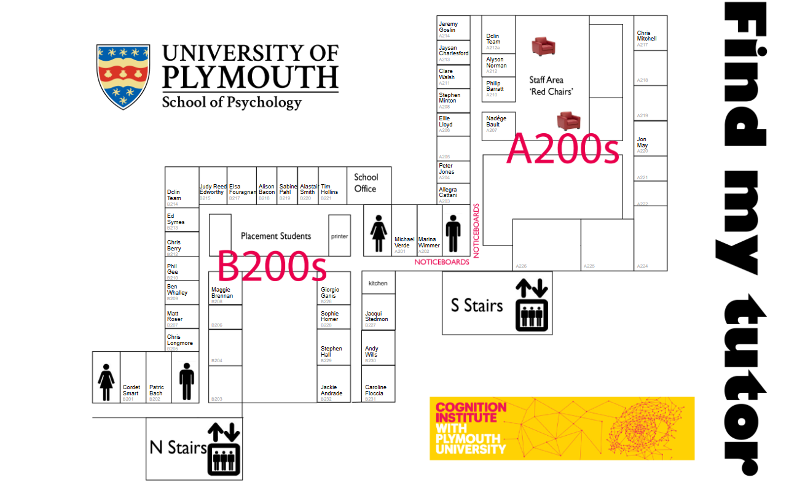
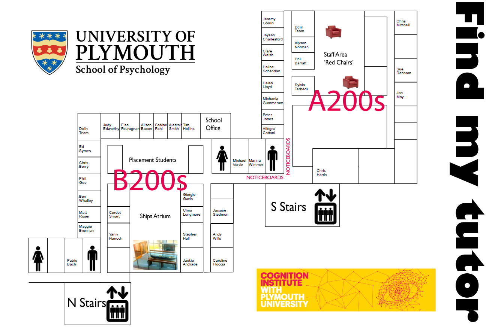

# Communication {#communication}

Good communication is essential for the programme to function well. There are 2
key modes of communication used on the course:

-   [Face to face](#office-hours) meetings during staff office hours.
-   [Email](#email).

#### I have a question, who should I speak to? {#i-have-a-question}

If you have a question about the course, or an issue which needs resolving, we
suggest that you:

0. Ask your peers (e.g. through a social network, or in class).

1. Ask the relevant module lead or project supervisor (in person or by email).
   If the problem is administrative in nature (e.g. module allocations) contact
   the [faculty administrator, Karen Barnett](#facultyadmin).

1. Contact either of the AP/CP programme leads (Chris Berry/Alyson Norman), or
   one of your [student representatives](#student-reps)

1. If your problem has not been resovled, contact the lead for postgraduate
   programmes (Ben Whalley), the [student advocate](#student-advocate) (Patric
   Bach), or the Associate Head for Teaching and Learning (Phil Gee).

1. If your problem is still not resolved satisfactorily, you should consider
   making a complaint. See the [section on complaints](#complaints)

## Face to face communication {#office-hours}

Academic staff are based in Portland Square on the second floor of A block and B
block.

Staff specify two ‘office hours’ during the week when they are in their offices
and **_available to answer student queries without an appointment_**.

**_Please use these office hours!_**

Talking to us face-to-face is usually a friendlier and more efficient way of
communicating than email, and students who come to our office hours tend to have
a better experience. Many staff will be available to see you outside their
office hours, but make an appointment first via email.

All our staff are researchers and administrators as well as teachers, so please
don’t be offended if you drop by unannounced and we are busy.

> It is anticipated that over the year an average student will see their tutor
> for about four to six hours during these sessions.

-[Find our where our offices are here](#finding-staff)

> As an aside, we find that students who meet regularly with academic staff
> during the year are often those who perform well on the degree. Don't hide
> away if you have questions or are unclear on material from lectures --- asking
> questions is the best way to learn.

## Email {#email}

The university uses Microsoft Office 365 to provide email and many other
services. These can all be accessed at:

-   <https://webmail.plymouth.ac.uk>

Login with your university email address, and computing account password.

###### Using email {#email-expectations}

> Email is the main way in which staff in the School and the University will
> communicate with you.

Important messages about the programme, including changes to assessments, or
changes in time and location of classes or exams, will be e-mailed to you.

> **_You must check your emails regularly – at least once a day during term
> time_**.

###### What you should expect from staff

-   All staff aim to respond to students promptly, and always within 2 working
    days.

-   You should **_not_** expect staff to respond outside of normal working hours
    (roughly 9am-6pm), and **_you should not rely_** on staff responding
    immediately when deadlines are looming. Peer/social networks or other forums
    might be a better bet at this point.

-   Out of term time, if a staff member is unavailable please contact the module
    leader or the programme coordinator. The [school office](#schooloffice) will
    also be able to put you in contact with available staff.

## Key people/contacts {#people}

## Key academic and support staff

-   [Module leads](#moduleleads)
-   Programme leads (see [programme details](#programme-specifics))
-   [The student advocate](#studentadvocate)
-   [Student representatives](#studentreps)
-   [Faculty administrator](#facultyadmin)
-   [School office](#schooloffice)
-   [Tech office](#techoffice)

### MSc module leaders {#moduleleads}

TODO ADD TABLE OF MODULE LEADERS

### The Student Advocate {#student-advocate}

Dr Patric Bach is the Student Advocate. His role is to mentor the student reps
and help them maintain excellent communication between you and the School.
Patric works with reps across all stages and all programmes in Psychology,
including the MPsych Advanced Psychology, BSc (Hons) Psychology and joint
honours programmes, and our postgraduate Masters and DClinPsy programmes.

See the [having your say](#haveyoursay) section and ensure your voice is heard
in the running of the course.

### Student representatives {#student-rep}

Course representatives are the most important channels of information for your
views. The representatives serve an invaluable function. We take what they say
very seriously, and we directly involve them in as much decision making as
possible. For example, they constitute a major voice on the Undergraduate and
Postgraduate Programme Committees.

It is important that you use your representatives to the full. In general the
representatives undertake a lot of work, much of which is unseen by the majority
of students. If you have an issue you can discuss it with one of your stage
representatives and they can approach a member of staff or the Programme Leader
to explore what can be done about the issue.

At the beginning of each academic year, students in each stage will be canvassed
for volunteers to take on the role of student representative. The normal pattern
is to recruit as many people as want to take on the role. The representatives
for each stage then share out the responsibilities which go with the role. For
example, one person might be good at organising meetings and summarising what
happens at meetings whereas someone else might be better at speaking out at
committees. One of the main responsibilities of the role is to communicate with
the stage constituencies and to represent the views of the stage to those with
operational responsibility for the programmes, usually at the Undergraduate and
Postgraduate Programmes Committee.

Photos and names of student reps will be posted on this site
<http://www.psy.plymouth.ac.uk/studentreps/>

Student reps are happy to be approached with questions or ideas before or after
classes. They can also be contacted by email.

### Senior Faculty Administrator {#facultyadmin}

Karen Barnett, <K.Barnett@plymouth.ac.uk> is the senior faculty administrator,
and the go-to person for any issues relating to academic regulations. She will
tyically be able to provide definitive answers to questions relating to
deadlines, coursework submission, [extenuating circumstances](#excircs) and much
else besides.

In Karen's absence, contact Michele Thomas <michele.thomas@plymouth.ac.uk>

### The 'School Office' {#schooloffice}

Administrative staff for the School of Psychology are located in the Portland
Square Office, B223, Portland Square Building.

School Office 84800 office.psy@plymouth.ac.uk

Naomi Swales 84800 nswales@plymouth.ac.uk

Gemma Hurrell 84801 gemma.hurrell@plymouth.ac.uk

Charmain Dawe 84800 charmain.dawe@plymouth.ac.uk

They can answer general questions about the school, will often know where people
are, and know how to claim expenses and other similarly useful things.

### The school technical office {#techoffice}

The Technical Services Office for the School of Psychology is located in the
Link Building Room 109.

Opening times are: Monday to Thursday 8.30 am – 5pm; Friday 8.30 am – 4.30pm

The technical staff can offer advice and help in relation to:

-   Computing (apart from Open Access PCs and software supported by ILS)
-   borrowing and use of equipment for psychology projects
-   bookings of specialist rooms available in the Link Building and instructions
    in their use
-   design and construction of equipment and software for use in psychology
    projects
-   other uses of resources
-   health and safety matters

Technical Manager: Anthony Mee

Senior Technicians:

-   Mark Cooper
-   Lynne James
-   Martyn Atkins

In the first instance, contact the Psychology technicians by email to
techoffice@psy.plymouth.ac.uk or phone 01752 (5)84853

## Finding staff {#finding-staff}

To find your tutor or other members of, the may below may be helpful:

\index{Staff offices} \index{Map of academic staff offices}
[{#map-of-staff-offices} Click to enlarge...](static/FindMyTutor_plain.png)

<!-- NOTE this map is created from code hosted here by Jon May:
https://github.com/PlymouthPsychology/floorplan
-->

### Full list of academic Staff {#staff}

Full details of all school staff are on the University website here:
<https://goo.gl/cMmI5n>. Below we list the staff you are most likely to meet on
the PRM, with links to their public webpages:

TODO ADD LISTS PEOPLE HERE FROM WAM... EVERYONE WHO IS ON MSC MODULE

To find a member of staff you can use the staff office map below:

## Accessibility {#accessibility}

This publication is also available in electronic format the university digital
learning environment (DLE). All publications provided by the School of
Psychology are similarly available. Direct any queries or concerns relating to
accessibility to your Programme Coordinator, or the Faculty of Health and Human
Sciences Student Reception on the fourth floor of the Rolle Building, telephone
number 01752 585332
([rollestudentreception@plymouth.ac.uk](mailto:rollestudentreception@plymouth.ac.uk)).
