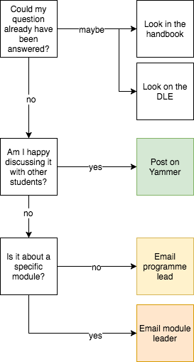

# Finding answers

In the course of your study

### Communication with staff {#communication}

\index{Communication}

Good communication is essential for the programme to function well.

There are 3 main modes of communication used on the course:

-   [Face to face](#office-hours) meetings during staff office hours
-   [Email](#email)
-   [Microsoft Teams](#ms-teams) (an instant messaging/discussion forum and more)

Each has it's own strengths: but we aware that all staff recieve high volumes of email and you should avoid using email, if possible.

### I have a question, what should I do? {#i-have-a-question}

\index{Asking questions}

The following diagram describes the best way of getting a question about the course or a module answered...



<!-- note this file is generated from static/commsflow.xml which
can be edited with https://www.draw.io or the desktop version of that app -->

### Face to face {#office-hours}

```{r, child="common/office-hours.Rmd"}

```

To find your tutor or other members of, the may below may be helpful:

\index{Staff offices}
\index{Map of academic staff offices}
[{#map-of-staff-offices} Click to enlarge...](static/FindMyTutor_plain.png)

<!-- NOTE this map is created from code hosted here by Jon May:
https://github.com/PlymouthPsychology/floorplan
-->

### If you are unhappy, or are not getting answers

{.xkcd}

If you have not received a satisfactory answer, or have not recieved a response, please contact:

-   [Your programme lead](#programme-lead)
-   [Your student representative](#student-rep)
-   [The student advocate](#student-advocate)

Please only do this if you have tried emailing and calling your tutor and have not received a response within two working days.

### Email {#email}

\index{Email}

The university uses Microsoft Office 365 to provide email and many other services. These can all be accessed at:

-   <https://login.live.com>

Login with your university email address, and computing account password.

#### Using email {#email-expectations}

Email is the main way in which staff in the School and the University will communicate with you.

Important messages about the programme, including changes to assessments, or changes in time and location of classes or exams, will be e-mailed to you.

**_You must check your emails regularly – at least once a day during term time_**.

What you should expect from staff:

-   All staff aim to respond to students promptly, and always within 2 working days.

-   However, you should not expect staff to respond outside of normal working hours (roughly 9am-6pm), and _should not rely_ on staff responding immediately when deadlines are looming. Yammer or other forums might be a better bet at this point.

-   Out of term time, if a staff member is unavailable please contact the module leader or the programme coordinator. The [school office](#schooloffice) will also be able to put you in contact with available staff.

If you change either your term time address or your normal vacation address please make sure that you inform the School. Whenever possible please supply telephone numbers with your addresses. The university has a strict policy of not releasing students’ addresses to third parties.

### Microsoft Teams {#ms-teams}

\index{Microsoft Teams}

MS Teams is a social-network and collaboraton tool for large organisations. It's a combination of a messenger-type chat system, and an internet forum, and a file store, and more.

We have set up a Team for all PRM and MPsych stage 5 students to use. To access the group visit:

-   <https://bit.ly/2NcC3Db>

You should be able to:

-   See the group, including chat conversation
-   Subscribe to email updates (if you don't plan to use the teams app on your phone or check the site regularly)

#### Using MS Teams

Resources are available from the university and externally on using Teams.

```{r, echo=F}
if(!knitr::is_html_output()){
  pander::pandoc.p("Note: content below may not display correctly offline. Please refer to the web version.")
}
```

The following video shows the basis of teams, and how the system works:

<iframe width="560" height="315" src="https://www.youtube.com/embed/7oej3xIQy-Y" frameborder="0" allow="autoplay; encrypted-media" allowfullscreen></iframe>
