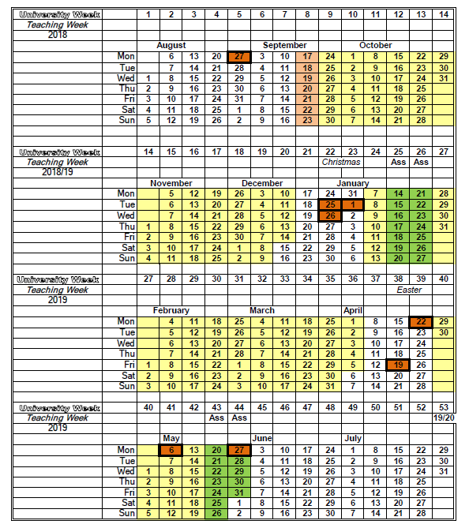

# Timetables, dates and deadlines

### The Academic year 20`r YEAR`/`r YEAR+1`

The University year is organised by week numbers which are assigned primarily for the purposes of undergraduate teaching and so can sometimes be confusing for MSc students. It's worth noting here that:

-   The year is organised into two semesters.

-   Vacation periods are not part of the semesters, although they interrupt them.

-   The research project does not fit neatly with the semester structure (as do taught courses). Expected work patterns for the project are explained in the separate project guidance notes.

The calendar on the following page shows the academic year.

-   Pink = welcome week
-   Yellow = teaching weeks
-   Blue = revision weeks
-   Green = examination weeks
-   Bank holidays are outlined in bold

The calendar also shows university week numbers, e.g. welcome week is week 8. Official timetables, module outlines, and other university documents may refer to these week numbers.



## Timetables {#timetable}

\index{Timetables}

Your personal timetable is available at: <https://timetables.plymouth.ac.uk>. Note that your timetable might take a few days to settle down if you were late in choosing your module options. A copy of the programme timetable (including _all_ modules) is available on the programme site as a backup if you are stuck.

-   It is vital that you check your timetable in the first weeks of term. You should particularly check you registered on all the correct modules and for the current year.

-   If you spot any inconsistencies please email Karen Barnett or contact the programme lead.

_This is very important because module registrations on the DLE are used for group-emails and notifications, and so you may miss important info if your registrations are incorrect._

## Coursework deadlines for 2018

\index{Deadlines}

PLEASE NOTE THAT DEADLINES MAY BE CHANGED DURING THE YEAR IN THE CASE OF ERRORS OR OTHER UNFORSEEN CIRCUMSTANCES. DO NOT RELY ON THIS PAGE UNLESS YOU HAVE RECENTLY DOWNLOADED IT FROM THE SCHOOL.

In these cases students will be notified, but the definitive source for deadline information is the DLE.

XXX TODO ADD DEADLINES```

---


