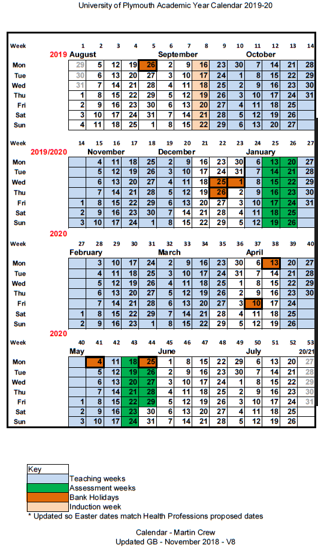

# Timetables, dates and deadlines

### Coursework deadlines for `r params$academic_year`

\index{Deadlines}

PLEASE NOTE THAT DEADLINES MAY BE CHANGED DURING THE YEAR IN THE CASE OF ERRORS
OR OTHER UNFORSEEN CIRCUMSTANCES. DO NOT RELY ON THIS PAGE UNLESS YOU HAVE
RECENTLY DOWNLOADED IT FROM THE SCHOOL.

In these cases students will be notified, but the definitive source for deadline
information is the DLE.

```{r, echo=F, include=F}
library(tidyverse)
library(lubridate)
mkdeadlinetable <- function(url){
  #url = 'https://wam.psy.plymouth.ac.uk/api/public/deadlines/?assessment__module__programmes__slug=msc-ap&format=json'
  #jsonlite::fromJSON(readr::read_file(url), flatten=T) %>%glimpse
  jsonlite::fromJSON(readr::read_file(url), flatten=T) %>%
  mutate(
    `Hand in date` = submission_date
  ) %>%
  select(assessment.module,
         assessment.name,
         assessment.module_credit_percentage,
         `Hand in date`,
         calculated_return_date
  ) %>%
  arrange(assessment.module, `Hand in date`) %>%
  mutate(assessment.module_credit_percentage=ifelse(assessment.module_credit_percentage==0, "P/F", as.character(assessment.module_credit_percentage))) %>%
  mutate(
    `Hand in date` = format(ymd(`Hand in date`), format="%d %B %Y"),
    calculated_return_date = format(ymd(calculated_return_date), format="%d %B %Y")
  ) %>%
  set_names(., c("Module", "Name", "Module %", "Hand in date", "Marks returned")) %>%
  pander::pander(split.tables=Inf, justify="llcll")
}
```

## MSc AP deadlines

```{r, echo=F}
mkdeadlinetable('https://wam.psy.plymouth.ac.uk/api/public/deadlines/?assessment__module__programmes__slug=msc-ap&format=json')
```


## MSc CP Deadlines

```{r, echo=F}
mkdeadlinetable('https://wam.psy.plymouth.ac.uk/api/public/deadlines/?assessment__module__programmes__slug=msc-cp&format=json')
```


## Timetables {#timetable}

\index{Timetables}

Your personal timetable is available at: <https://timetables.plymouth.ac.uk>.
Note that your timetable might take a few days to settle down if you were late
in choosing your module options. A copy of the programme timetable (including
_all_ modules) is available on the programme site as a backup if you are stuck.

-   It is vital that you check your timetable in the first weeks of term. You
    should particularly check you registered on all the correct modules and for
    the current year.

-   If you spot any inconsistencies please email Karen Barnett or contact the
    programme lead.

_This is very important because module registrations on the DLE are used for
group-emails and notifications, and so you may miss important info if your
registrations are incorrect._

## The Academic year `r params$academic_year`

The University year is organised by week numbers which are assigned primarily
for the purposes of undergraduate teaching and so can sometimes be confusing for
MSc students. It's worth noting here that:

-   The year is organised into two semesters.

-   Vacation periods are not part of the semesters, although they interrupt
    them.


