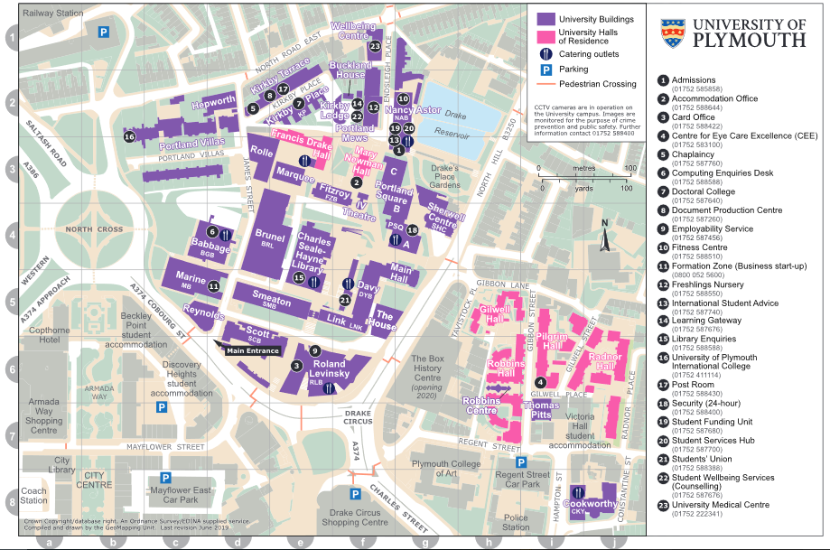

# Help and support {#helpandsupport}

Help and support with your learning, and for other aspects of life at university
(e.g. mental health) are available through the school and the university.

This section provides links to many of the most useful services.

## Learning Support

### The Writing Café:

The Writing Café is a welcoming and purposeful space where you can explore
techniques and strategies to improve your writing 4th floor Babbage Building
Email: <thewritingcafe@plymouth.ac.uk>

It is run by Student Learning, who have many useful resources on their webpage:
https://www.plymouth.ac.uk/student-life/services/student-services/learning-development

### Self-help quiz

Learning Support have developed a self-help tool for students. It takes the form
of a quiz which asks questions like ‘is your first language English?’ or ‘do you
have financial worries?’ and, depending on the answers, directs students to the
relevant support services. It takes about 5 minutes.

Note that you must enroll yourself using the link at the top left of the
Self-Help page:

<https://dle.plymouth.ac.uk/course/view.php?id=19395>

## Students’ Union Advice Centre (UPSU:advice)

The Advice Centre is independent form the University and therefore can provide
confidential and free advice and support to you whilst you are studying.

The Advice Centre provides advice on the University’s regulations and procedures
including appeals, complaints, Disciplinaries and the Study Wellbeing and Review
policy; Student Finance England queries; Housing advice; Consumer issues and we
are the only the organisation within the city that deals with how welfare
benefits interact with student finance and can provide full benefit calculations
for students.

We are open all year round, although it is always best to check our website
during vacation times as we may be running a reduced service. We are situated on
the first floor of the SU building on the Plymouth Campus and offer advice
through drop in sessions; appointments which can be booked at
www.upsu.com/advice ; email and telephone.

Telephone: 01752 588373 /0800 953 0155 Email: advice@su.plymouth.ac.uk

## Counselling Service {#counselling}

The University offers individual counselling for students experiencing distress.

For more information see:
<https://www.plymouth.ac.uk/student-life/services/student-services/counselling/consultation-with-a-counsellor>,
call 01752 587676, or email studentcounselling@plymouth.ac.uk

## Student Funding Unit

> "Whether it’s advice on student loans and grants, information on bursaries and
> scholarships, help with extra financial support, EU funding or casework, our
> Student Funding team can advise you on all aspects of student funding. For
> tips and advice, our managing your money pages are packed with ideas on how to
> make your student budget go further."

-   Opening hours are Monday – Friday, 9.30am – 4pm.
-   4th Floor, Nancy Astor Building

## Accommodation Office

The university has a range of halls and managed accomodation, and the
accomodation office can help with this and private accomodation.

-   https://www.plymouth.ac.uk/student-life/services/accommodation
-   01752 588644
-   accommodation@plymouth.ac.uk

## Disability Assist

Disability Assist is part of Learning Support and Well-being and is are
available to help with your study support requirements if you have a disability.

-   <https://www.plymouth.ac.uk/student-life/services/student-services/disability-and-dyslexia>
-   01752 587676
-   das@plymouth.ac.uk

## Multi-Faith Chaplaincy

-   01752 587760
-   chaplaincy@plymouth.ac.uk

## Medical Centre

(Term-time only)

-   Peverell Park Surgery and Beaumont Villa Surgeries
-   01752 222341

## Support for International students {#international-students}

The International Student Advice (ISA) group provides specialist services and
guidance if you're an international student studying at Plymouth University.

See
<https://www.plymouth.ac.uk/student-life/services/international-students/international-student-advisory-service>
for more information, call 01752 587740 or email
<international.advice@plymouth.ac.uk>.

## PsySoc

A message from the Chair:

> “PsySoc was founded at the end of 2006 by students who felt that there was a
> real gap for a society where Psychology students from all years could meet
> each other, socialise and learn from each other’s experiences. It was in this
> mind that we decided that PsySoc would provide traditional social
> get-togethers, but also some academic activities such as guest lecturers, book
> sales, and support. PsySoc aims to provide an outlet for all students to get
> together and enjoy each other's company, be it in an academic or social
> setting, and our committee works hard to make sure that this happens. We do
> have a FaceBook site, and we will be making ourselves known throughout the
> year, so there is plenty of opportunity to join us in whatever capacity you
> feel is right for you, from helping out other students, attending guest
> lectures or just joining us on a social. However much you want to join in,
> PsySoc provides the opportunity to meet other psychology students from all
> years, and from all backgrounds.”

<https://www.upsu.com/societies/6833/>

## Visas and international

#### Tier 4 visa {#tier4}

Some international students will require
[Tier 4 visas](https://www.gov.uk/tier-4-general-visa) to study in the UK.

The [UKBA](https://en.wikipedia.org/wiki/UK_Border_Agency) (United Kingdom
Border Agency) has issued new requirements for students with a Tier 4 student
visa:

The University must retain copies of the personal identity pages of your
passport plus pages covering your current leave and all UK leave stamps, and a
copy of the Identity Card for Foreign Nationals (if applicable). These documents
must be copied before your faculty enrolment is completed. Details of scanning
points on campus will be circulated.

Records of attendance must be kept for all students with a Tier 4 student visa
applied for with a CAS (Confirmation of Acceptance for Studies ) number. You
will be asked to swipe your Plymouth University ID card in the reception of ISAS
(16 Portland Villas) every 2 weeks during term time. It is important to keep
your faculty or ISAS notified of any periods of non-attendance , perhaps due to
absence from Plymouth or illness etc. You will be contacted if you miss more
than 2 consecutive swipes.

-   You must maintain up-to date personal contact details on the student portal
    at all times. Please note: the university must report to the UKBA:

-   A specified period of non-attendance

-   If you cease to study at the university for any reason (withdrawals,
    suspensions, interruptions etc)

-   If your study circumstances change such as a change in course, or if the
    duration of your course changes.

-   If it is known that you are not complying with the conditions of your leave

Please see ISAS (International Student Advisory Service) to discuss or clarify
any of the points above.

ISAS: Roland Levinsky Gateway: <international.advice@plymouth.ac.uk>,
<www.plymouth.ac.uk/isas>

## Campus Maps

### Health and Safety {#healthandsafety}

The primary responsibility for your safety and your health lies with yourself.
The University, Faculty and School publish Safety handbooks which are available
online through the portal. These provide guidance on safe working practices and
specific risks which you may encounter.

###### Fire

In the event of a fire alarm sounding you must leave the building by the nearest
available main exit. If your route to a main exit is obstructed then you should
evacuate by way of the next available fire exit. When the alarm sounds you must
stop what you are doing immediately, even if you are in the middle of an
experiment you must stop. If you are a researcher running an experiment then you
should make sure that your participant(s) respond to the alarm. Do not use the
lifts or re-enter the building until the all clear is given by a fire marshal
(wearing a yellow tabbard)

###### General Hazards

The responsible safety manager is Professor Tim Hollins, as Head of School.
Safety coordination within the School is delegated to the Technical Manager,
Anthony Mee. Any concerns about safety should be communicated to Anthony in the
Technical Office, Room Link 109. If you become aware of any hazard or broken
equipment this should be reported immediately to the Technical Office.

###### Health

If you make extensive use of computers you should familiarise yourself with
advice available online regarding posture and working position. In general
laptops are poorly designed for extensive periods of use and desktop screens
should be adjusted to be at eye level. If you suffer from any condition
requiring medication or reducing your mobility please make sure that those
around are aware and know what to do in the event of an emergency. Security
staff are all trained first aiders, and in the Link block Lynne James in the
Technical Office is also a First Aider.

###### Lone Working

Students are not allowed to remain in the Labs after 5pm unless accompanied by a
member of staff. Undergraduates should never work alone with public
participants. Personal alarms are available from the Technical Office if
required.
