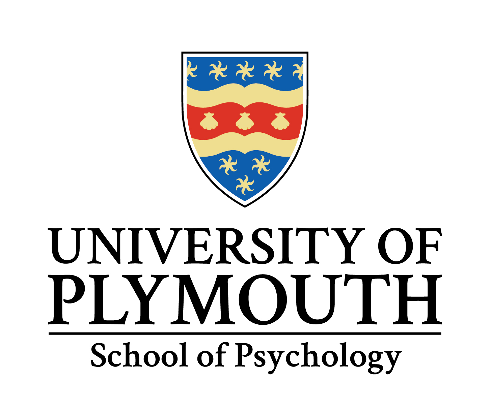

```{r, include=F, echo=F}
# bookdown::serve_book(daemon = TRUE, preview=FALSE)
```

# {-}

:::{.logo}

```{r, out.width="300px", echo=F}
if (knitr::is_html_output()){
    
}
```

:::

<style>
    .title {text-align:center;}
    .logo {text-align:center;}

</style>

```{r setup, include=FALSE}
knitr::opts_chunk$set(echo=F, include=T, warning=F, messages=F)
options(digits=2)

# knitr::opts_knit$set(root.dir = rprojroot::find_rstudio_root_file())

library('tidyverse')
library('tools')
library('stringr')
library('readxl')
library('pander')


```

### Welcome

{.thumbnail}

> Welcome to your master's studies at the University of Plymouth. For you, this year is the start of
> a fascinating intellectual journey to the heart of psychology.

Whether you are returning after several years of work, joining us from another
institution, or continuing your undergraduate study at Plymouth, psychology is
an exciting and dynamic subject. It has grown enormously in scope and influence
within the last decade or so. The range of expertise of our staff reflects this
dynamism and diversity. We are sure you will enjoy the opportunities that
studying within this environment will bring.

Your work this year will form an essential foundation for postgraduate study of
psychology, or advanced psychological practice. Graduates of the course have
succeeded in a wide range of academic, and professional roles, and the course is
designed to help you maximise your ability to exploit psychological knowledge to
succeed in the workplace.

It is important that you remain focused on your work, and do well in your
assessments. Remember, if you need advice or help with an area of work or with
something outside the course that affects your work, you have a personal tutor
who is a member of staff in the School, and you can approach him or her when you
need to. Your fellow students are another important source of help and advice:
our community of masters students is tight knit and supportive, so make the most
of your peers.

The information in this handbook complements the University’s online student
handbook. It is helpful if you familiarise yourself with the contents of both
before teaching starts, and you will need to refer to it throughout the year. If
you have previously studied at Plymouth, you will find somethings familiar, but
many aspect of postgraduate life will still be new.

If you have a question about this year, then you should be able to find an
answer in the handbook. If you cannot find the answer to your question here,
then the best place to ask initially is the Faculty of Health and Human
Sciences, Student Reception (on the fourth floor of the Rolle building). The
staff there will either be able to answer your question or direct you to someone
who can. Alternatively, you can ask your programme lead.

The staff in the School of Psychology welcome you as a fellow member of the
School and of the University, and look forward to working with you on the
challenge and excitement of studying psychology.

Good luck, and enjoy your year.

Professor Tim Hollins Head of School
