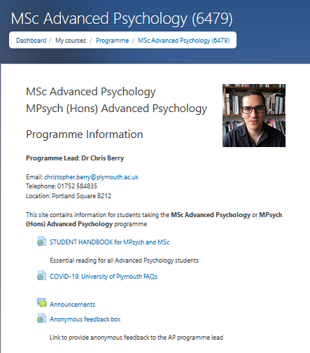

# Learning resources {#resources}

## The Digital Learning Environment

\index{DLE} \index{Moodle}

You will hear much talk of 'the DLE', which stands for _Digital Learning
Environment_. It also sometimes gets called 'moodle', which is the name of the
software used by the system.

The DLE is central to your learning at Plymouth, and you need to familiarise
yourself with it as soon as possible.

Put simply, the DLE is a website run by the university to provide students with
a central point for all course information, and for you to
[submit work](#submitting-coursework) and recieve feedback.

You can login to the DLE at: <http://dle.plymouth.ac.uk>.

Please make sure you check the following on the DLE as soon as possible:

-   Your _programme site_
-   The site for each of your semester 1 modules
-   Your university email^[You should check your university email at least once
    per day to avoid missing important communications from the school. See the
    [expectations around email](#email) section.].

On each module site you should^[If any of these are missing or not obvious,
please let the module leader or programme coordinator know] see:

-   A module outline
-   Key readings for the course
-   Copies of lecture slides and handouts^[At least 48 hours before each
    lecture; normally much longer]
-   A place to [submit coursework](#submitting-coursework)

## RStudio Server

The school provides an online service called RStudio Server, which you will
learn more about in PSY556.

The service is available at: <https://rstudio.plymouth.ac.uk>

To access it you will need an account.
[Please contact the techoffice for details](#techoffice).

## The Library and Computing Resources

### Specialist librarian for Psychology

Kerri Daymond <kerri.daymond@plymouth.ac.uk> is the specialist librarian for
psychology and can answer questions relating to availability of books and other
resources, including requests for journal articles.

### University computing resources {#computing}

Technology and Information Services (TIS) provide computing facilities in Open
Access areas for students. These are located on the first floor of the Babbage
Building, Fitzroy Building Level 3 and on all floors of the Library available
every day of the week, including weekends, until late and with a 24/7 facility
in the Plymouth Library.

> Open Access PC availability can be checked from
> <http://PCfinder.plymouth.ac.uk>

Through a username and password, each student has access to a networked service
providing a range of general software packages (word processing, spreadsheets,
databases, graphics), specialist software (e.g. statistical packages), email and
the Internet. Secure file space is available for each student to store their
coursework.

### The library

Most of the Psychology collection is located on Level 2 of the library.

-   You can search the library catalogue and collections of online journals
    using [Primo](http://primo.plymouth.ac.uk)
    ([http://primo.plymouth.ac.uk](http://primo.plymouth.ac.uk)).

-   The library contains a range of electronic information sources, media
    workshop facilities and a variety of study spaces, including a 24/7 Open
    Access Computing Area.

-   Kerri Daymond is the specialist librarian for Psychology
    ([Kerri Daymond](mailto:kerri.daymond@plymouth.ac.uk)) and may be able to
    help with specialist queries. More detailed information about library
    services and facilities can be found by going to the
    [Library pages on the University Intranet](https://www.plymouth.ac.uk/student-life/your-studies/library).

-   If you are finding it hard to access particular items, then please give the
    author and title of the item to
    [Kerri Daymond](mailto:kerri.daymond@plymouth.ac.uk), who will
    investigate.

### Computing and technical support {#tech-support}

The university offers numerous IT systems and offers support to students. Find
out more on the IT services webpages (<https://goo.gl/Qhl8cz>), email
<libraryandITenquiries@plymouth.ac.uk> or call 01752 588588 to report a fault.

There are 24/7 dedicated Science Postgraduate computing facilities available in
the Fitzroy Building and also open access suites in the Library and Babbage
Buildings.

The school [Technical Office](#techoffice) deals with specific Psychology
computing software and hardware requirements.

## Working spaces

A number of spaces are available for postgraduates to work:

-   Psychology students may use the new Psych:EL space, on the third
    floor of the link building, when formal teaching is not scheduled.

-   Psychology students may also use Link 106 and 107 when no teaching is
    scheduled in this room. Weekly timetables for these room are often posted
    outside the door at the start of the week to allow you to plan your self
    study time.
    
-   On level 3 of the library you will find a designated quiet Post Graduate 
    study room. The library also has many computers available on the ground floor, 
    and bookable rooms for quiet study.

-   There is a dedicated postgraduate computer facility in room 304 in the
    Babbage Building. The access code for this room is 2486. Advisory Desks in
    the library and on level one of the Babbage Building are staffed from Monday
    to Friday (083O to 1700). Colour printers, photocopiers, disk dispensers and
    campus card revaluator equipment are also located here.

## University access cards

You are entitled to a University Card, which you will need to do the following:

-   Identify yourself as a member of the University
-   Enter the library and borrow books
-   Access other buildings/rooms (e.g. certain 24/7 computing facilities,
    recreational facilities and rooms in some buildings)
-   Prove your id for examination purposes

It will also enable you to

-   Receive discounts in some local stores
-   Park for free on the Plymouth campus on Saturdays
-   It may also be used for access to further buildings and for printing/copying
    facilities.

As a new student you should upload a photo as soon as you've enrolled. Your
University card will be issued at your faculty induction session; you will be
required to show proof of identity when you collect your card.

Inform the office immediately if your University card is lost. You can purchase
a new one using the e-store facility or visiting the Card Office with ID and a
£5 fee.

### Out of hours access

Postgraduates may apply for access to the School outside of normal office hours,
please see the your project supervisor if you need extended hours.

## Psychology Test Library

The School of Psychology Test Library is available to final year students
looking to use tests for their dissertation and is free of charge. The library
consists of around 400 tests and scales and the list of tests available can be
checked on-line at https://www.psy.plymouth.ac.uk/PsychometricTests/

To borrow tests please get in touch with the Information Assistant, Fiona
McChrystal for advice.

You can contact the Fiona McChrystal by e-mail or telephone:

-   Office: Link 305
-   e-mail: fiona.mcchrystal@plymouth.ac.uk
-   telephone: +44 (01752) 584840
