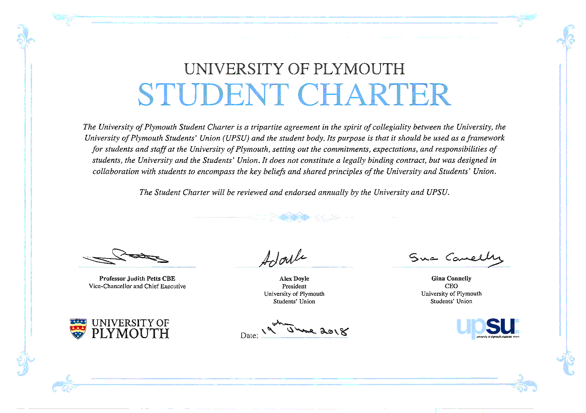
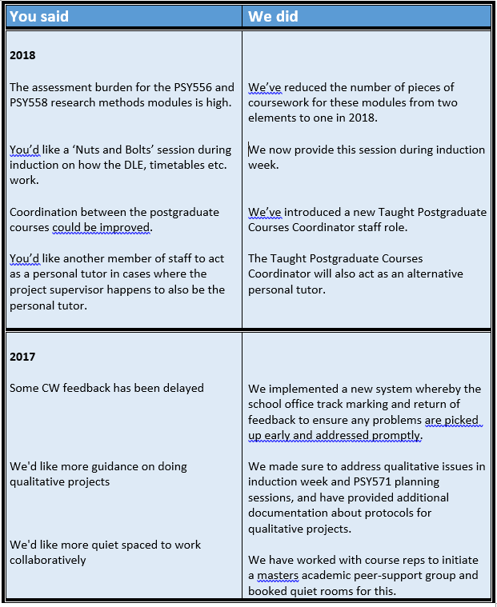
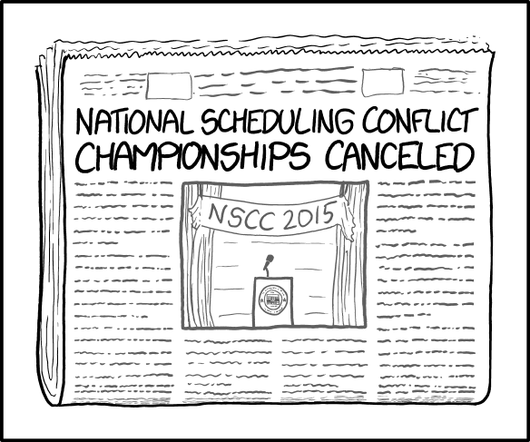

# Our commitment

-   [Listen to you](#listening)
-   [Resolve problems promptly, as they arise](#resolving-problems)
-   [Communicate clealy](#clear-communication)
-   [Act fairly, and without discrimination](#equality-diversity)

## Listening to our students {#listening}

#### Have your say {#haveyoursay}

Your experience matters to us – much of what we do is aimed at helping you
learn, so we need to know whether we are doing the right things. The School of
Psychology is a learning community, and students should consider themselves
active participants.

When things go wrong or could be made even better than they are now, it is quite
likely that you will spot it before we do. So, it is important that you let us
know when there are problems. These problems vary in how easily they can be
addressed. Some can be dealt with straight away once they are brought to the
attention of the right person. Other problems require more detailed
consideration and widespread discussion, so they inevitably take longer to fix.
Sometimes they are large enough to warrant a major course overhaul and may not
be fixed in time to benefit you. However, such changes to the course will
benefit those who follow on in the future. Sadly, there are some problems that
are a consequence of resource limitations or external constraints, and we may
not be able to do much about them, but at least we will be able to let you know
the reasons why those problems exist. In any event, it is important that you let
us know what you think, and you can be sure that your views will be an important
part of any decision making process.

#### If something is wrong, _please let us know_.

When things go wrong or could be made even better than they are now, it is quite
likely that you will spot it before we do. So, it is important that you let us
know when there are problems. These problems vary in how easily they can be
addressed. Some can be dealt with straight away once they are brought to the
attention of the right person. Other problems require more detailed
consideration and widespread discussion, so they inevitably take longer to fix.
Sometimes they are large enough to warrant a major course overhaul and may not
be fixed in time to benefit you. However, such changes to the course will
benefit those who follow on in the future. Sadly, there are some problems that
are a consequence of resource limitations or external constraints, and we may
not be able to do much about them, but at least we will be able to let you know
the reasons why those problems exist. In any event, it is important that you let
us know what you think, and you can be sure that your views will be an important
part of any decision making process.

> If you have a question now, take a look at our
> [guide to getting questions answered](#i-have-a-question).

#### The student charter {#student-charter}

The Student Charter is an agreement between the University, the Students’ Union,
and the student body. It sets out the expectations that you should have of the
University, and also the expectations we have of you. For instance, you can
expect that we will provide you with a challenging and invigorating curriculum,
and we expect you to take an active role in your learning. We hope the charter
provides a useful framework for both staff and students.

You can find the full text here:
https://www.plymouth.ac.uk/your-university/student-charter

#### Informal feedback

You can [meet with academic staff at any time during the year](#office-hours).
All staff have two office hours which they should make known during lectures,
and during these periods you can drop in with questions without an appointment.

#### Course Reps and The Student Advocate

Student reps are psychology students who have either volunteered or been elected
to represent all students on their programme. Reps have an important role in
communicating your views to the School. They are supported by a senior member of
staff - the Student Advocate - who helps them turn your suggestions about the
course and the School into actions. Student reps are happy to be approached with
questions or ideas before or after classes. They can also be contacted by
email.^[Contact details for the student reps will be posted on the programme DLE
site once they are appointed, after 30th September.]

Dr Patric Bach is the schools' Student Advocate this year. His role is to mentor
the student reps and help them maintain excellent communication between you and
the School. Patric works with reps across all stages and all programmes in
Psychology, including the MPsych Advanced Psychology, BSc (Hons) Psychology and
joint honours programmes, and our postgraduate Masters and DClinPsy programmes.

Reps for the MSc courses and the Student Advocate attend meetings of the
Postgraduate Programme Committee twice a term to present the issues relevant to
their course, including teaching and assessment arrangements, the coverage of
the course, and issues with the wider university. Their role is to make the
voice of Psychology students heard at School level and to communicate the
position of the School of Psychology back to students.

#### Formal feedback and evaluation of the programmes

At various points whilst studying on your programme, you will be asked to
provide formal structured feedback about the modules you are studying and the
programme as a whole. This feedback takes two forms. First, the School of
Psychology asks you to complete a module evaluation in each semester. These
evaluations are online and are completed by accessing a special module
evaluation web page. This web page is accessible via the DLE. You will be given
instructions on how to access the page at the time when module evaluations are
required.

Second, the University asks MSc students to complete an annual University-wide
survey. This allows the University to track the views of students about their 
course and the University facilities.

When you are asked to complete one of these evaluations, please take the time to
do so. The information which can be obtained from them is vitally important in
monitoring the quality of courses, and provides information which can help in
the planning of future courses and facilities.

All responses to these evaluation instruments are confidential or anonymous. You
will never be identified as an individual. There will be no comeback on you in
any form for any views which you express in these surveys.

#### Feedback box

We also have an online feedback box, which you can use to tell us about the
course. It is completely anonymous. Your identity is not recorded unless you
write your name or email address in the box, so you might prefer this to email
if you want to express your views without us knowing who you are. The feedback
box is here:

-   <https://www.psy.plymouth.ac.uk/communitybox/>

#### The MSc Programme Committee

The Programme Committee is a formal venue for the management of the programme,
and the exchange of views between staff and student. Elected student
representatives are invited, and meetings are normally held at least twice a
year. We earnestly hope that students will feel able to raise problems
informally (and before these meetings) so they may be dealt with as soon as
possible. ^[See the programme DLE site for more information about the programme
committee.]

## Resolving problems promptly {#resolving-problems}

TODO XXX

#### "You said... we did..."

Some examples of student feedback that made a difference last year:

## Clear communication {#clear-communication}

XXX TODO

#### Cancelled classes {#cancelled-classes}

\index{Cancelled classes}

[{.xkcd}](static/scheduling_conflict_2x.png)

If a class has to be cancelled, we contact you as early as possible, usually via
email. Sometimes lecturers become unavailable (e.g. sudden illness) without much
notice. When this happens, please help us by using your own contact networks to
share information with other students. We will often provide a replacement class
for any that is cancelled, or rearrange teaching so that all essential material
is covered.

## Equality and Diversity {#equality-diversity}

<!-- TODO ADD MORE? -->

> “An important part of our University is the value we place on being a diverse
> and inclusive community, where we learn and benefit from our rich variety of
> backgrounds and beliefs. This in part is why the University of Plymouth is
> such an enriching place to work and to study.” Professor Judith Petts CBE

-   Vice-Chancellor and Chief Executive, University of Plymouth

Evidencing our commitment to equality and diversity, Plymouth holds
an[Athena Swan Bronze award](https://www.plymouth.ac.uk/your-university/about-us/university-structure/service-areas/equality-diversity-and-inclusion/athena-swan).

You can read more about our approach to
[equality and diversity at the university here.](https://www.plymouth.ac.uk/your-university/about-us/university-structure/service-areas/equality-diversity-and-inclusion)

[There are also monthly equality and diversity updates from the university here](https://mailchi.mp/a23e9ba882ee/the-ed-update)
