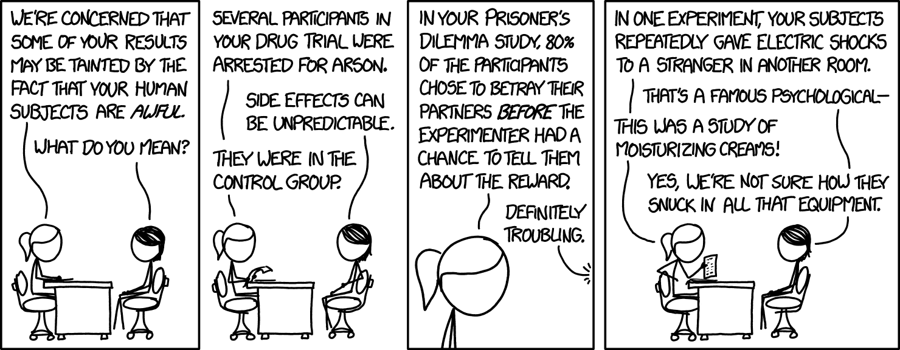

## Research project

The project counts for 60 credits out of a total of 180 for the MSc AP as a 
whole, or 60 out of 120 credits for the MPsych AP, and is thus a very 
substantial piece of work.

The ability of students to conduct and report a major piece of research work is
of central importance. Students should be aware that the quality of the project
work will be ofconsiderable interest to potential employers, PhD supervisors
etc., with whom they may wish to work on completion of this degree. Project work
has a large bearing on the reference given and potential employers may ask to
see a copy of the project report.

Approval of project topics and allocation of supervisors will be the
responsibility of the Programme directors. In order to maximise the range of
possible research topics, supervision may be arranged with any full-time member
of staff of the School, not just those teaching on the programme.

### Points and participant payments {#participation-points}

\index{Budget} \index{Expenses}

AP students are given 40 points within our research participation pool. More
information (user guides) is available here:
http://www.psy.plymouth.ac.uk/home/Stage5/

[{.xkcd}](static/ human_subjects_2x.png)

If you would like to participate in other students experiments, please contact
pointsadmin@psy.plymouth.ac.uk

AP students also have a project budget of £120 which can be used to pay
participants.

You must discuss this spending with your supervisor first. The relevant forms to
complete are then:

-   [AP project costing form (docx)](static/forms/MSc MPsych AP Project costing form.docx)

-   [Participant payment form (docx)](static/forms/Participant_Payment_Cash_Advance_Request_Form_Psychology_2013.docx)

### Ethics

All student projects must be approved by the faculty ethical committee before
data collection begins, using the online system at
[https://www.psy.plymouth.ac.uk/SOPEthics/Login](https://www.psy.plymouth.ac.uk/SOPEthics/Login).

Where ethical approval is not required for a particular project, students must
arrange for their supervisor to email the programme lead explaining why this is
the case (e.g. project is a meta-analysis) to obtain a waiver.

**Failing to obtain ethical clearance or a waiver will cause you to fail the
module.**

### NHS ethics

Students wishing to run projects based in the NHS will also need ethical
clearance from the appropriate NHS ethics committee. Students wishing to run
projects involving children will also need clearance from the Criminal Records
Bureau. This may cause delay, so submission for ethical clearance well before
the project planning deadline is recommended.

### Work with children or vulnerable adults

Research with children recruited through specific institutions (e.g., Schools)
will need, in additional to the ethical clearance from the School, the approval
of the authorities in charge of the institution, the approval of parents.

Projects involving children, vulnerable adults or NHS patients will also require
clearance from the Criminal Record Bureau. This procedure can take several
months.

### Supervision

Students are expected to make to regular contact with their assigned supervisor
and may be penalised if they run work which has not been approved. Supervisory
contact is required for the following purposes:

-   Advising on the literature review - although responsibility for detailed
    searches lies with the student
-   Advising on and approving the design of the empirical work
-   Advising on and approving the method of analysis to be used
-   Advising on the interpretation of findings and the plan for the final
    report.

The supervisor must not be asked to comment on drafts of the report itself which
they will be responsible for marking together with a second independent marker.

See also 'conduct of the student' below.

### Supervision out of term time

Staff are not guaranteed to be on campus after the end of year period on the
university calendar and the School cannot guarantee availability of supervision
after this date (during the summer vacation). For this reason it is effectively
a requirement that the empirical phase of the project work be completed by this
date. It is strongly recommended also that students produce and agree with their
supervisors a plan for the final report by the same date.

### School Resources

#### Bookable labs

There are a range of bookable lab cubicles for individual or pairs of
participants. These include:

-   Dedicated staff labs. These facilities are open to postgraduate use through
    the staff research groups who use them. Facilities include ERP Lab (101),
    Baby Lab (208), Soft Lab (209), Well-being Lab (210), EMG Psycho-physical
    Lab (213), Eye tracker Lab (214), Vision Specialist Labs (215), Audiology
    Lab (216), VR Lab (217)
-   The observation labs (203 & 205)
-   Labs capable of running five to eight simultaneous participants.

From October - March there can be quite high demand for labs and we implement
the following measures to ensure fair access for all:

-   You can only book 3.75 hours a day, which can't span lunch.
-   Sessions end and key cards must be returned at 12:45 for the morning and
    16:45 for the afternoon.
-   You must obtain ethical clearance _before_ booking lab time.

#### Experimental software/hardware

The Technical Office can write custom applications and produce special hardware
to fill most experimental requirements – contact the technical manager for more
information. If requesting the tech office write software for your experiment,
we strongly recommend that you:

-   Specify what you want to appear on screen in as much detail as possible,
    including mockups in power point and with list

-   Specify exactly how you want the data to be recorded, and what variables
    should be saved

-   **_Test the software thoroughly before using with participants._** This
    should involve a complete run-through of the experiment followed by an
    attempt to analyse the resulting data. It is only by attempting to analyse
    the data saved that many problems can be identified.

It can also help to create a paper prototype and test this with other students
before sending the spec to the tech office^[See
https://en.wikipedia.org/wiki/Paper_prototyping].

### Borrowing Equipment

There is a selection of equipment available for loan from the Technical Office,
including computers, cassette recorders, stopwatches etc. If you intend to
remove the equipment from the campus then a loan form must be signed, as
equipment is not insured when off campus.

A note on security:

-   All rooms containing equipment must be left locked whenever the room is left
    unattended even if this is only for a short period.
-   If you are the last person to leave a laboratory it is your responsibility
    to ensure that it is locked, the technicians in room 109 will always have a
    key.
-   Particular care should be taken to ensure that the computer labs are not
    left unlocked when there is nobody using them.

### Conduct and contribution of the student

Our aim is that masters projects represent a substantial piece of research,
which makes a novel and publishable contribution to the literature. This
requirement usually dictates that students will work collaboratively with their
supervisor, and both will contribute to the final design and analysis of the
study. That is, projects are unlikely to be a truly _independent_ piece of
research.

As a consequence, we do not customarily make detailed accounting of students'
contribution to projects and try to adjust marks accordingly. The reason is that
it is not possible to devise a fair scheme to compensate students for their
relative contributions to projects when the different facts of this contribution
are not necessarily commensurable.

However, we do provide second markers with information about your conduct during
the design, running and analysis of the project, and our policy is to use this
information where i) the work appears to sit at the threshold between two grade
points or ii) to resolve discrepancies between the first and second marker.
Thus, a student who submits a manuscript on the borderline between a grade of B+
and A-, but who made a substantial contribution to the design and development of
their project, would be awarded the higher of these two grades.

To reassure students who are engaging in detailed conversations regarding the
design and analysis of their projects: this is both normal an expected. You will
not be penalised for this because it is a normal part of science to collaborate
with other researchers. Only where such help is deemed excessive, or the student
overly-dependent on supervisory assistance would this become an issue, and your
supervisor will discuss this with you should this uncommon situation arise.

### Publication of Projects

Project work should be potentially of publishable standard. Although it is not
formally required, we wish strongly to encourage the submission of project work
for publication and offer some advice in this section. It will rarely be the
case that a project report - however highly marked - will be suitable for
submission as a journal article without alteration. Students should therefore
consult closely with their supervisor about the amendments needed prior to
submission. Since this will occur after the examination process, supervisors
will be free to advise in detail and to contribute themselves to the write-up.

The authorship of publications arising from projects would normally be joint
between the student and supervisor with the student’s name appearing first. This
is the default recommended since it is required that the student substantially
contribute to design of the project as well as conduct the work, and hence merit
first authorship. The level of supervisory input also expected, however, would
usually imply justification for the supervisor as second author.

Where a project needs considerable rewriting for publication which the student
lacks time or skill to complete this, it may be agreed that the supervisor
completes the write-up and appears as first author. If a student has not written
up their research within two years, then the supervisor may use the research in
publications, with themselves as first author and the student as co-author.

Any student who succeeds in publishing a project, even if some time after
leaving Plymouth, is requested to inform the Psychology modular masters
co-ordinator and send a copy of the paper.

## Writing up your project

\index{Projects (writing up)}

> _I have already made this paper too long, for which I must crave pardon, not
> having now time to make it shorter._ Benjamin Franklin, 1750

The Master’s project is a substantial piece of work, and should be reflected in
the care and attention given to the reporting of your results. However, the
length of research reports is not a reliable indicator of the effort required to
produce it, nor of it's quality.

To communicate your findings, we recommend that you identify a suitable
high-impact psychological journal and organise your manuscript according to
their authors instructions. Examples of suitable journals might include _Journal
of Experimental Psychology: General_, _Journal of Consulting and Clinical
Psychology_, or _Qualitative Psychology_. This will almost always produce a
manuscript which has the follwing sections:

-   Abstract
-   Introduction
-   Methods
-   Results
-   Discussion

Most journals will accept manuscripts in the region of 4,500 to 6,500 words with
a maximum of around 5 tables and 5 figures, and with around 250 words allowed
for the abstract. The upper limit for masters dissertations is 10,000 words,
excluding tables and references. However we suggest that you aim to keep your
report closer to the limits imposed by the major journals, unless there are
specific reasons why a longer report is desireable, and you have agreed this
with your supervisor. Where a project is overly long, or lacks precision in the
writing, then this will be marked down accordingly.

To be clear: there is an upper limit of 10,000 words that will only be
appropriate in a few cases. Almost all reports will be between 4,500 and 6,500
words, varying with the nature of the project. If in doubt, check with your
supervisor.

### Use of appendices

Appendices should not become a dumping ground, and should only include
information necessary for the scientific understanding of your work. Examples of
things which should _not_ be included in an appendix:

-   Illustration of the primary task used (e.g., screen capture or diagram).
    This should be a figure in the main report, or you should simply cite the
    original paper describing the task. Where a task has many variants which
    might interest a reader but which aren't central to communicating the
    findings, however, they might be included in an appendix.

-   A copy of the participant consent form with signatures from all
    participants.

-   Brief and debrief

-   SPSS printouts. All relevant statistical results must be reported in the
    Results section, in the format prescribed by the American Psychological
    Association in their Publication Manual.

-   Questionnaires. If using your own questionnaire or a questionnaire that is
    not protected by copyright, report it in a Table. If using a questionnaire
    protected by copyright, or a measure which is widely used and described in a
    another publication, you must make sure that your method section gives a
    good description of what the questionnaire assessed and how it was
    structured but you should not report the items. You must also make sure that
    you cite the source of the questionnaire.

### Typography and layout

There is no page limit for the project, but please:

-   Include a standard cover sheet.
-   Use a 12 point font
-   Use double line spacing (tables may be left singlespaced)
-   Leave at least 4cm in the right hand margin

You should include a title page with the following information:

-   Title of the study
-   The text “Thesis submitted to the University of Plymouth for the [MSc/MPsych
    in ___] by [your name]”, and the year at the bottom of the page.

\noindent Next should be a page on which you copy the following text:

> “The work reported in this thesis received ethical approval from the Faculty
> of Health and Human Sciences and complies with the guidelines set by the
> British Psychological Society.”

\noindent On this page you can also include acknowledgements (thank people who
helped you get through your project and add any comment you see fit).

On the next page would be your actual report. References should start on a page
of their own. Figures and tables should be placed at relevant locations within
the text and clearly labelled and numbered. Don't copy them all to the end of
the manuscript.

### Contribution of the student

Second markers will be given information about the conduct and contribution of
students. This should not be used for the routine adjustment of marks (e.g.
higher marks for larger student contributions) but instead should be used to
disambiguate work near grade boundaries, or to resolve discrepancies between
markers.

### Expectations of AP projects

The design and analysis of AP student projects should reflect the extended
coverage given to methods in the course. Projects need not demonstrate
competence in every technique covered but -- where relevant -- reports should
demonstrate students’ awareness of key concepts and handle data accordingly.

Key concepts include:

-   Statistical power
-   Statistical inference and causation
-   Pitfalls of null hypothesis significance testing
-   Handling repeated measures data
-   Missing data
-   Issues in qualitative data analysis

Where AP students propose a project that requires only very simple analysis
(e.g. pairwise correlations or simple t-tests) this may be appropriate if the
project is methodologically demanding in other areas (e.g. recruitment,
complexity of data acquisition), or where this is based on the recommendation of
the supervisor. However it is generally expected that AP projects will be more
methodologically ambitious than undergraduate projects or MSc/PGDiP projects,
and markers will normally award the highest marks only where this is the case.

### Project marking

All projects are double-marked by supervisors and another academic within the
school. Where a fail grade is given by one or both markers, then a third marker
will also assess the work. The normal
[guidelines for marking within the school apply](#assessment).

### Indicative grades

A mark of 50-59% or more indicates competent work of masters standard; a mark of
60-69% indicates work at the merit level and a mark of 70% or more indicates
work at distinction level. For all masters courses, the pass mark is 50\%. Below
are the characteristics of report which markers will use to determine your
grade:

<!-- ## For MPsych

A mark of 50-59% or more indicates competent work of masters standard and will be awarded a 2:2.  A mark of 60-69% indicates a 2:1, and a mark of 70% or more indicates a first.  -->

Introduction : The introduction should show:

    - Range, relevance and quality of understanding shown in the student’s reading of literature.
    - Organisation and quality of the prose. You should aim to be concise and precise throughout the report.
    - Clarity of the exposition of the rationale for the study, and the linkage with the literature review.

    NOTE: Because the project report should be modelled on the form of a journal article, introductions should be focused on specific aims and not contain detailed reviews of literature not directly relevant to the study.

Method : The methods section should demonstrate

    - Quality of the design and relevance to the objectives of the study.
    - Level of ambition in terms of both the scale of the study and the relative complexity of the methodology employed. This will vary between programmes, and markers will take account of the time available to complete the project: MPsych projects will typically be the simplest, because of time constraints; MSc PRM projects will be the most methodologically ambitious.
    - Competence and thoroughness in the conduct of the study.
    - Presentation of the method section in terms of clarity, organisation, thoroughness and concision. You should present all details necessary to replicate the study, but not more.

Results : Results sections should evidence

    - Quality, competence, appropriateness, and thoroughness of the analysis of data.
    - Organisation and clarity of the presentation of results.
    - Appropriateness and quality of presentation of graphs, figures and
    tables.

Discussion : A discussion should show:

    - Clear exposition of the findings.
    - Understanding and interpretation of the findings.
    - Critical appraisal of the study and its methodology.
    - Discussion of broader theoretical implications in the context
    established by the introduction.
    - Quality of presentation of arguments; organisation, style and clarity.

### Data sharing and research transparency

\index{Data sharing}

All of the data you collect should be submitted alongside your project report,
unless specifically agreed with your supervisors and the programme lead in
advance (for example, because of practical or ethical constraints).

These data should be documented, such that other researchers could replicate
your analysis if required.

More guidance will be given throughout the project planning and project modules,
but as a minimum we would expect AP students to submit:

-   Raw datafiles in csv or other appropriate format
-   Code to combine/process data into an 'analysable data file' - normally a csv
-   The analysable file itself

In addition, it is increasingly becoming the norm to submit code for the
analyses you report alongside your data, for example using R or RMarkdown files.

### Qualitative projects

For projects employing qualitative or interpretative methods, special ethical
conditions may apply — for example to audio or transcript data. This may prevent
putting all data in the public domain. However you should aim to:

-   Secure consent from participants to share anonymised transcript data.
-   Share anonymised transcripts, as far as this is ethical/practical.
-   Share details of intermediate analyses, e.g. using software such as NVivo.

