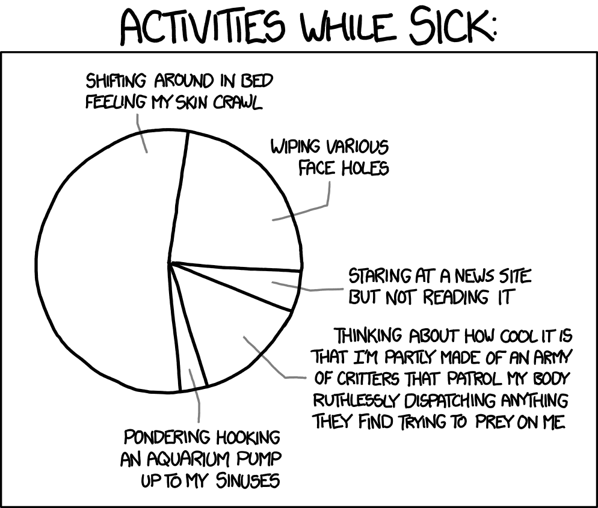

# When things go wrong!

Inevitably things go wrong --- perhaps because you are ill, or because some
aspect of the course delivery falls short of our usual standard --- but there
are some important things you can do to make sure problems are resolved quickly
and don't affect your studies:

1.  [Talk to your tutor or another member of staff](#letusknow)
1.  [Use the extenuating circumstances system appropriately](#excircs)
1.  [Access the relevant university support services](#helpandsupport)

## Let us know {#letusknow}

If you have a problem that is affecting your study it is important to let us
know.

-   [Who should you speak to?](#i-have-a-question)

## Extenuating circumstances (EC) {#excircs}

The aim of the Extenuating-Circumstances policy is to ensure you are not
disadvantaged in your studies by serious, significant circumstances beyond your
control.

As described in the Plymouth Compass framework
(https://www.plymouth.ac.uk/your-university/teaching-and-learning/plymouth-university-compass),
we encourage you to become a resilient and thriving individual and a competent
and confident professional. This means that, while studying with us, we expect
you to be able to deal with the inevitable ups and downs of life, including
minor illnesses or personal issues, so that they don’t affect your studies and,
in particular, your ability to attend or complete assessments.

Sometimes, however, you’ll face a serious situation which has a significant
impact on your ability to attend or complete assessments. The University calls
such situations ‘extenuating circumstances’ (ECs). This extenuating
circumstances policy describes how we can support you by taking such situations
into account.

[{.xkcd}](static/sick_day_2x.png)

The Extenuating-Circumstances policy and guidelines, and an application form,
can be found here:
https://www.plymouth.ac.uk/student-life/your-studies/essential-information/exams/exam-rules-and-regulations/extenuating-circumstances

More detailed information is provided in the policy document here:
https://www.plymouth.ac.uk/uploads/production/document/path/13/13328/Extenuating_Circumstances_Policy_and_Procedures.pdf

### Long-term health conditions

Long term health conditions can be described as conditions which:

-   are persistent, typically lasting for more than three months and often
    life-long

-   cannot be resolved in a short time, or which will recur regardless of
    action, or which need to be managed on a long-term basis

-   are a long-term or permanent illness that often results in some type of
    disability and which may require you to seek help with various activities

-   can be managed but can ‘flare-up’

Examples of conditions which fall into this category are: Cystic Fibrosis,
Costochondritis, Fibromyalgia, Chronic Fatigue Syndrome (ME), Psychosis, and
Bipolar Disorder.

If you have a long-term health condition, you should discuss any support needs
with Disability Services (or equivalent in partner institutions) before or soon
after commencing your programme of study. It is hoped that the condition can be
managed and / or you can be supported sufficiently by Disability Services (or
its equivalent in partner institutions).
https://www.plymouth.ac.uk/student-life/services/learning-gateway/disability-and-dyslexia

However, there may be times when unexpected difficulties or flare-ups arise. On
these occasions, you are required to claim extenuating circumstances affecting
specific assessments. However, rather than requiring you to provide evidence for
your condition with every extenuating circumstance claim, if you have a
long-term health condition, you may wish to complete a long-term ill health
form, available from the Faculty Office (or equivalent for partner
institutions). This form must be accompanied by a statement from your GP,
hospital consultant or appropriate specialist responsible for your treatment
which provides clear confirmation of the nature, severity, duration and effect
of your condition on your studies.

You should submit the form to the Faculty Office for consideration. Once a claim
is authorised, you will continue to be required to submit an extenuating
circumstances claim for any missed assignment submission deadline, test, or
examination which is directly attributable to a flare-up of your long-term
health condition, but you will not be required to resubmit evidence.

As a result of this process, we may need to invoke the
[Fitness to Study](#fitness-study) process to consider your case in more detail.

You must inform your Faculty or partner institution of any change in your
condition, whether improvement or deterioration, in order that the claim can be
reassessed. The Faculty or partner institution may require further evidence from
time to time. You will be contacted at the start of each academic year to review
your case.

### Fitness to Study {#fitness-study}

The university is committed to an ethos of equality and inclusivity, and aims to
facilitate and promote positive health and wellbeing through the recognition and
understanding of all relevant health conditions and disabilities. Occasionally a
student’s circumstances or health may impact upon their own, or others’ ability
to fulfil that potential. Levels of risk will be assessed by the university on a
case-by case basis in conjunction with appropriate professionals.

The Fitness to Study policy and the accompanying procedures are to be followed
by Plymouth University staff where significant concerns have arisen as a result
of a student’s extended absence, health condition, wellbeing or other
circumstances that lead to an inability to progress in their programme, or that
adversely affect others. The key purpose of the policy is to ensure that the
best interests of the student are met and to provide appropriate guidance and
support.

Further details can be found in this link:
https://www.plymouth.ac.uk/student-life/your-studies/essential-information/regulations

### Key points

-   Apply for EC as early as possible. Retrospective applications are not
    normally allowed.

-   Don't submit coursework if you are unfit to complete it properly and plan to
    apply for EC. This is especially so if you have or can obtain corroborating
    evidence for the extenuating circumstances. Most reasonable claims are
    granted, but if you sit an exam or submit coursework you will be deemed to
    have been "fit to sit", and thus not able to claim extenuating-circs
    affected your performance.

-   Applications for EC normally require corroborating evidence, but students
    are allowed to self-certify (e.g. for illnesses where medical attention
    would not normally be sought) once in each academic year.

-   To make an application for extenuating circumstances contact Karen Barnett
    directly: <K.Barnett@plymouth.ac.uk>, 01752 584515.

## Withdrawal/Suspension from a Programme

There may be occasions when you decide to withdraw or interrupt your studies for
certain reasons. If so, you need to consult your programme lead and seek advice.

If you decide to withdraw or interrupt you must inform the programme coordinator
and the faculty secretary as soon as possible.

Students should be aware that there are deadlines for the full or partial refund
of tuition fees. Further information is available here:
https://www.plymouth.ac.uk/student-life/your-studies/essential-information/regulations/withdrawing-from-or-suspending-study

## Complaints {#complaints}

{.xkcd}

Inevitably things go wrong from time to time. As a school we pride ourselves on
listening to students and resolving problems promptly.

> [Our communications section describes how to ask questions and report problems
> on the course.](#i-have-a-question) Please follow these steps first.

If you have not received a satisfactory answer, or have not recieved a response,
please contact the school[ advocate](#student-advocate), or the School Associate
Head for Teaching and Learning, Phil Gee.

Please only do this if you have tried emailing or meeting the member of staff
responsible for the aspect of the course at issues, and have not received a
response within two working days.

The university also has an
[official complaints procedure described here](https://www.plymouth.ac.uk/student-life/your-studies/essential-information/complaints-appeals),
but we would expect that almost all issues can be resolved by the programme team
in the first instance. Please do contact the programme lead or student advocate
first.
